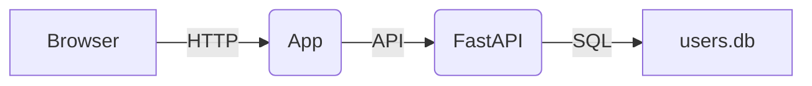

# Документация проекта «Помощник учащегося»

## Содержание
1. [Введение](#1-введение)
2. [Архитектура](#2-архитектура)
3. [Структура репозитория](#3-структура-репозитория)
4. [Описание компонентов](#4-описание-компонентов)
   - [Бэкенд](#41-бэкенд)
   - [Фронтенд](#42-фронтенд)
5. [База данных](#5-база-данных)
6. [API-эндпоинты](#6-api-эндпоинты)
7. [Развёртывание](#7-развёртывание)
8. [Контакты](#8-контакты)

---

## 1. Введение

Проект «Помощник учащегося» представляет собой веб-приложение для управления образовательными ресурсами и активностями с разграничением доступа по ролям (администратор, преподаватель, студент).

Цели проекта:
- Обеспечить удобный интерфейс для создания и управления курсами.
- Автоматизировать планирование расписания и событий.
- Обеспечить безопасный доступ к данным через JWT.

## 2. Архитектура

Архитектура построена по принципу клиент–сервер:

- Клиентская часть (Frontend): одно-страничное приложение на React.
- Серверная часть (Backend): REST API на FastAPI с базой данных SQLite.
- Docker Compose для оркестрации контейнери­зованных сервисов.



## 3. Структура репозитория

```
/backend               — FastAPI (API, модели, схемы, CRUD, аутентификация, инициализация БД)
  ├─ main.py            — маршруты и события старта
  ├─ models.py          — SQLAlchemy-модели
  ├─ schemas.py         — Pydantic-схемы
  ├─ crud.py            — функции работы с БД
  ├─ auth.py            — JWT, безопасность
  ├─ database.py        — настройка подключения и инициализация БД
  └─ Dockerfile         — контейнеризация сервиса

/front                 — React (страницы, компоненты, стили)
  ├─ src/
  │  ├─ pages/         — основные страницы (Courses, Profile и т.д.)
  │  ├─ components/    — общие UI-компоненты (Header, Sidebar)
  │  ├─ services/      — API-клиенты для работы с бэкендом
  │  └─ styles/        — глобальные и модульные CSS
  ├─ public/           — статические файлы и HTML-шаблон
  └─ Dockerfile        — сборка фронтенда и Nginx

/docker-compose.yml    — настройки для одновременного запуска бэкенда и фронтенда в контейнерах
```

## 4. Описание компонентов

### 4.1 Бэкенд

- **main.py** — инициализация приложения, маршруты, CORS, монтирование статичных файлов, запуск `init_db()` при старте.
- **models.py** — определение таблиц SQLAlchemy: `User`, `Role`, `Course`, `CourseFile`, `UserActivity`.
- **schemas.py** — описания Pydantic-моделей для валидации входящих и исходящих данных.
- **crud.py** — базовые операции CRUD (create, read, update, delete) для всех сущностей.
- **auth.py** — функции аутентификации (проверка пользователя, генерация JWT).
- **database.py** — настройка движка SQLAlchemy и инициализация БД файла `users.db`.

### 4.2 Фронтенд

- **pages/** — страницы приложения: `Courses`, `AddCourse`, `StudentCourses`, `Profile`, `Notifications`, `Schedule`, `Calendar`.
- **components/** — повторно используемые UI-элементы: `Header`, `Sidebar`, `Footer`, `ProtectedRoute`.
- **services/** — модули для взаимодействия с API (fetch, CRUD-запросы).
- **styles/** — единые CSS-переменные и стили.

## 5. База данных

Используется SQLite (файл `users.db`). При старте приложения вызывается `init_db()`, который создаёт все таблицы на основе моделей.

Основные таблицы:
- **roles** (id, name, description)
- **users** (id, username, email, password_hash, full_name, is_active)
- **user_roles** (связь многие-ко-многим)
- **courses** (id, title, description)
- **course_files** (id, filename, url, course_id)
- **user_activities** (id, user_id, action, timestamp)

## 6. API-эндпоинты

### Аутентификация
- **POST** `/token` — получение JWT-токена

### Роли
- **GET** `/api/roles`
- **POST** `/api/roles`

### Пользователи
- **GET** `/api/users`
- **POST** `/api/users`
- **GET** `/api/users/{id}`
- **PUT** `/api/users/{id}`
- **DELETE** `/api/users/{id}`

### Курсы
- **GET** `/api/courses`
- **POST** `/api/courses`
- **GET** `/api/courses/{id}`
- **PUT** `/api/courses/{id}`
- **DELETE** `/api/courses/{id}`

### Файлы курсов
- **GET** `/api/courses/{id}/files`
- **POST** `/api/courses/{id}/files`
- **DELETE** `/api/courses/{course_id}/files/{file_id}`

## 7. Развёртывание

1. Установить Docker и Docker Compose.
2. Выполнить в корне проекта:
   ```bash
docker-compose up --build
   ```
3. Перейти в браузере:
   - `http://localhost:3001` — API
   - `http://localhost:3000` — интерфейс приложения

## 8. Контакты

- **Автор**: Ваша команда или имя
- **Email**: example@domain.com
- **GitHub**: https://github.com/your-repo 